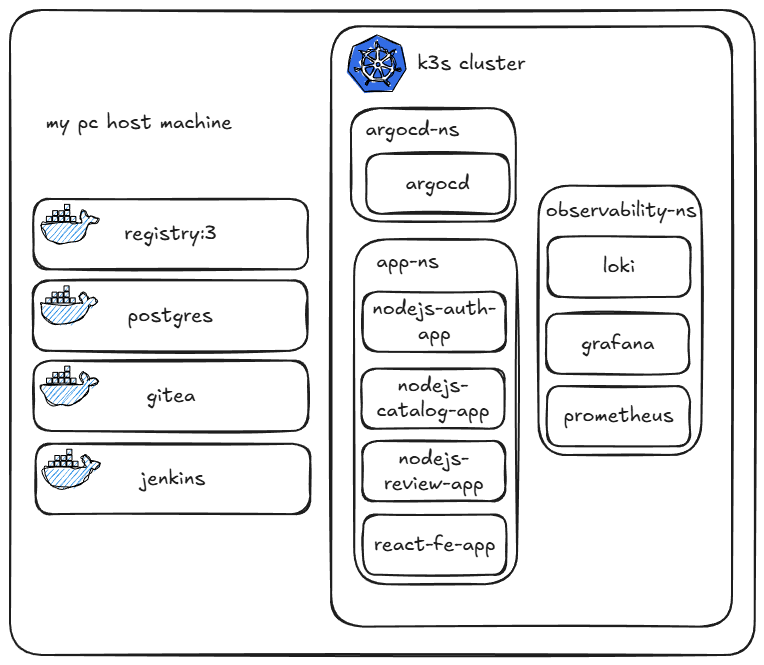

# Behemoth App Manifests

This repository contains the Kubernetes manifests and ArgoCD configurations for the **Behemoth** application ecosystem. It follows a GitOps approach for managing both application services and infrastructure components.

## Architecture Overview

The project is structured into three main categories:

1.  **Application Services (`apps/`)**: Microservices that form the core of the Behemoth platform.
2.  **Monitoring Infrastructure (`monitoring/`)**: Monitoring tools with grafana, promtail, loki, and prometheus
3.  **ArgoCD Configurations (`argocd/`)**: Application definitions for automated deployment.

### Application Services

- **Auth Service**: Node.js based authentication service.
- **Catalog Service**: Node.js based service for managing movie catalogs.
- **Review Service**: Node.js based service for user reviews.
- **Frontend (FE)**: React-based web interface.

### Monitoring Components

- **Prometheus**: Metrics collection.
- **Grafana**: Visualization dashboards.
- **Loki**: Log aggregation.

## Deployment Strategy

This repository utilizes the **App-of-Apps** pattern with ArgoCD.

### Prerequisites

- A Kubernetes cluster.
- ArgoCD installed in the `argocd` namespace.

### Bootstrap

1. To deploy the entire app stack, apply the root-app manifest:
   ```bash
   kubectl apply -f argocd/root-app.yaml
   ```
2. To Deploy the monitoring stack, apply the monitoring-app manifest:
   ```bash
   kubectl apply -f argocd/monitoring-app.yaml
   ```
   ArgoCD will automatically discover and sync all applications defined in `argocd/apps/`.

## Repository Structure

```text
.
├── apps/                   # Kustomize manifests for application services
│   ├── behemoth-nodejs-auth-service/
│   ├── behemoth-nodejs-catalog-service/
│   ├── behemoth-nodejs-review-service/
│   └── behemoth-preact-fe/
├── monitoring/               # Helm values and configurations for monitoring tools
│   ├── new/
│   │   ├── behemoth-servicemonitor/
│   │   ├── loki-app.yaml
│   │   ├── service-monitor-app.yaml
│   │   └── prometheus-app.yaml
│   │
│   └── monitoring-app.yaml/
│
└── argocd/                 # ArgoCD Application manifests
    ├── root-app.yaml       # The "App of Apps" entry point
    └── apps/               # Individual ArgoCD app definitions
```



## GitOps Workflow

1.  Modify manifests in `apps/` or `platform/`.
2.  Commit and push changes to the repository.
3.  ArgoCD detects the changes and synchronizes the cluster state automatically.

## Grafana Tips

1. The "Big Picture" (Cluster & Namespace)

   - Dashboard ID: 15760
   - What it is: Kubernetes / Views / Global.
   - Why this one: It is the most modern and "clean" dashboard for general health.
   - How to use it: Once imported, look at the top left dropdown. Change the Namespace to behemoth.
   - Key Insight: It will show you if any of your 3 Node.js services are hitting their CPU limits or if K3s is "throttling" them (making them slow).

2. The "App Heartbeat" (Node.js Internal)
   - Dashboard ID: 11159
   - What it is: Node.js Application Dashboard.
   - Why this one: Since you have Node.js apps, you need to see things Prometheus doesn't know about by default—like the Event Loop delay and Heap Memory.
   - Requirement: For this to show data, your Node.js code needs to be using the prom-client library to expose these specific metrics.
3. The "Log Stream" (Loki)
   - No ID needed (Custom Panel).
   - Why: There isn't a "standard" dashboard for every app's logs because every app logs differently.
   - What to do: 1. Go to your imported 15760 dashboard. 2. Click Add > Visualization. 3. Select Loki as the source. 4. Enter the query: {namespace="behemoth"}. 5. Change the visualization type to Logs. 6. Place this panel at the bottom of your dashboard.

## License

[Specify License, e.g., MIT]
