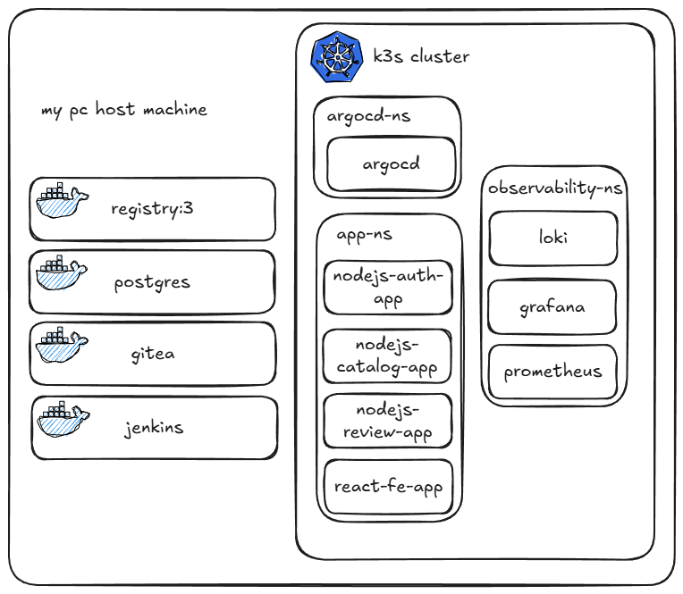
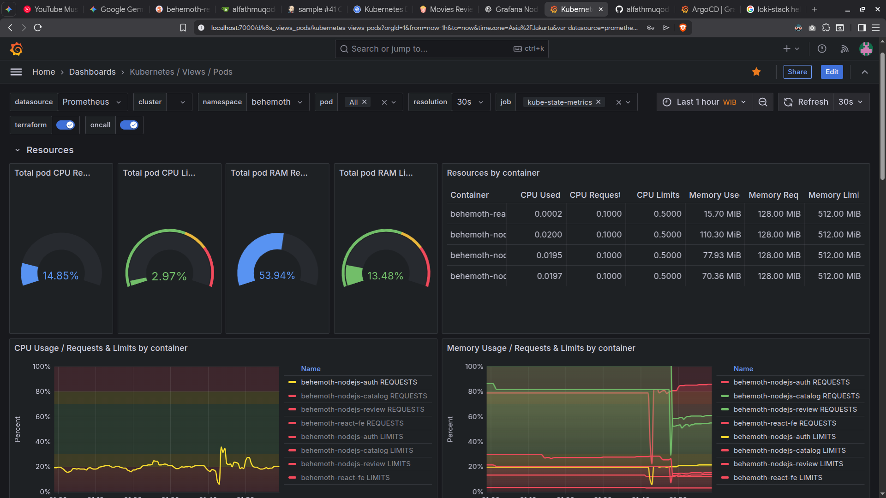
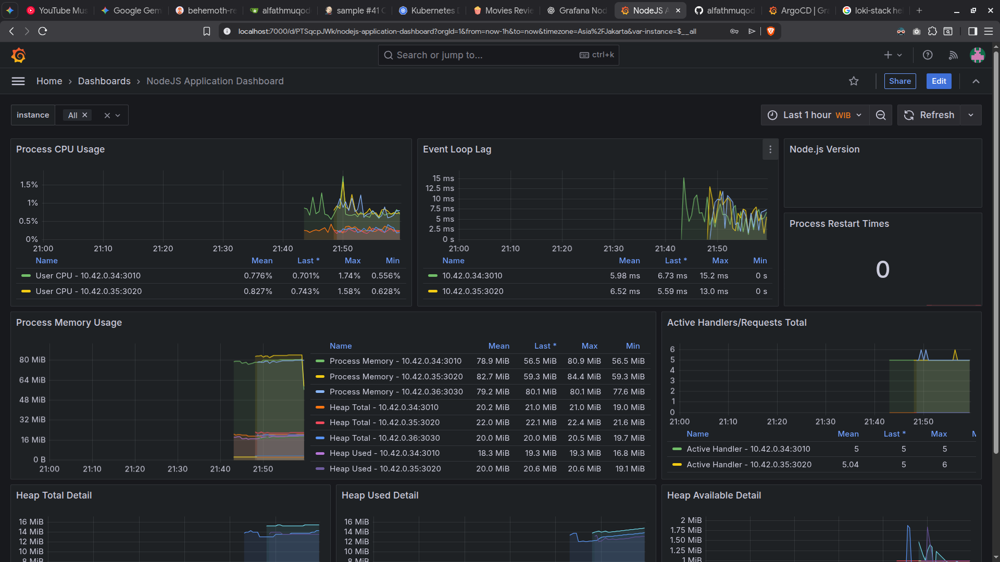
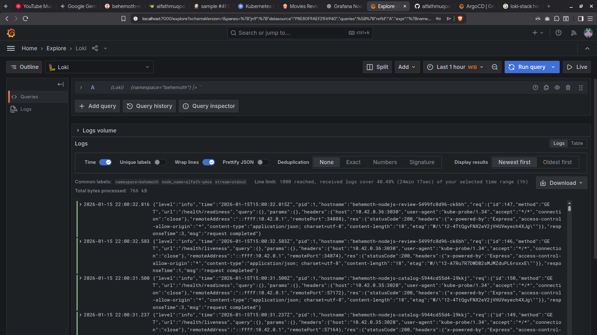
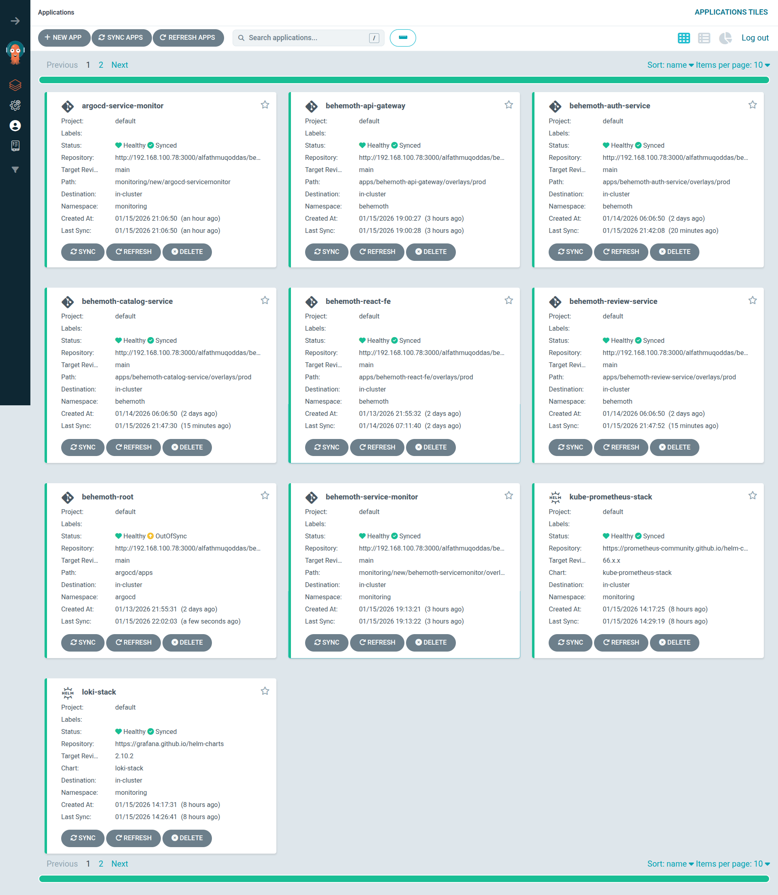
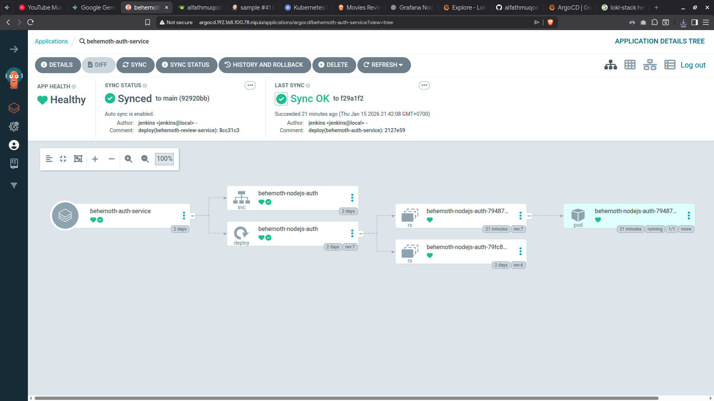
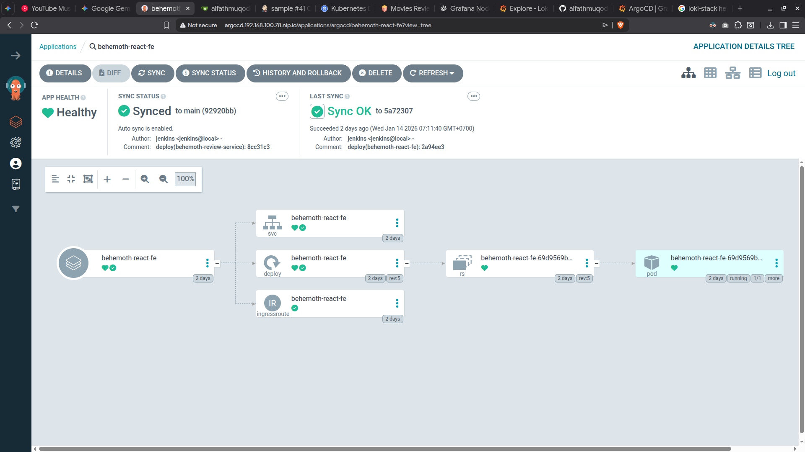

# Behemoth App Manifests

## Introduction

This is my attempt to replicate a(n) (almost) complete SDLC of an enterpise company, especially in banking one where they tend to have on-premise environment rather than cloud-native one, but still adhere to cloud-native architecture. I named it **Behemoth Ecosystem** because it sounds big and menacing.

The architecture comprises three layers: Application, Integration (CI/CD), and Observability. In the Application layer, I have created several Node.js-based microservices that adhere to 12-factor app principles—the industry standard for highly scalable and maintainable cloud-native applications. The Integration layer handles the process from code push to production deployment, commonly known as Continuous Integration/Continuous Deployment (CI/CD). Finally, in the Observability layer, I utilize monitoring tools to track application health post-deployment. This ensures the app runs smoothly and allows us to detect anomalies or mitigate issues before they impact the user.

This repository only contain the Kubernetes and ArgoCD project manifest and configurations for the **Behemoth** ecosystem, so that i can rollout the project declaratively. Application and Integration Components repo is in the separate directory, more on that later.

### Architecture Overview

The manifests is structured into three main categories:

1.  **Application Services (`apps/`)**: Microservices that form the core of the Behemoth platform.
2.  **Monitoring Infrastructure (`monitoring/`)**: Monitoring tools with grafana, promtail, loki, and prometheus
3.  **ArgoCD Configurations (`argocd/`)**: Application definitions for automated deployment.

### Application Stack

For the application stack, I chose **Node.js** and **React** due to their simplicity and my experience with them, which allowed me for rapid scaffolding. The backend utilizes **PostgreSQL** with **Sequelize** as the ORM. For authentication, I implemented **Asymmetric JWT** using private and public key pairs to sign and verify tokens; I chose this approach not only for its security but also as a practical exercise in managing secrets within a **Kubernetes** environment.

Feature-wise, the application is very simple, consisting of CRUD operations distributed across multiple microservices rather than a single monolith. I intentionally avoided over-complicating the logic to ensure a smooth transition to the next project phase. On the frontend, I used Tailwind CSS for styling and SWR for data fetching. Below are the specific details of the applications:

- **Auth Service**: Node.js based authentication service [link](https://github.com/alfathmuqoddas/behemoth-auth-service)
- **Catalog Service**: Node.js based service for managing movie catalogs. [link](https://github.com/alfathmuqoddas/behemoth-catalog-service)
- **Review Service**: Node.js based service for user reviews. [link](https://github.com/alfathmuqoddas/behemoth-review-service)
- **Frontend (FE)**: React-based web interface. [link](https://github.com/alfathmuqoddas/behemoth-react-fe)

For observability, I added logging with **Pino** and used **prom-client** for metrics. I chose Pino because it is a very performant alternative to Winston, while prom-client provides seamless integration with **Prometheus**. **Promtail** will collect the logs and eventually be consumed by **Loki**, more and on that later.

The application layer perhaps the most straightforward part of this ecosystem, aside from my deep experience in the field it also easy to debug, where to patch, etc, especially since I'm using typescript which adds compilation process that will prevent runtime error. Compared to the Intergration and Observabilty layer that are primarily config-driven make it quite hard to debug due to silent error it produced, also more on that later.

### Integration Components

The integration components are basically the tools I used to perform ci/cd and the environment in which the apps live. For the record, all the components are running on a single local machine, thanks to the power of containerization. Besides Argo CD, all the components are in Docker container with shared network. I chose **K3s** for a lightweight kubernetes cluster meant for resource-constrained environment like my local machine. It supports the same API as the standad Kubernetes but it uses SQlite instead of etcd for the scheduling, however that's not really matter for this project. Since I'm only using single local machine it doesnt have high availability feature albeit K3s fully support it, maybe if i have enough money i could create multi-node configuration for the next project.
I utlize **Jenkins** and **Jenkins jnlp agent** with Docker-outside-Docker configuration as the main orchestrator for the CI pipeline. I chose **Docker Registry** for a simple image registry merely to store images for the CI purpose. Initially I planned to use **Harbor** as it is an industry-standard approach, but since I am using a local machine then it wasn't very efficient approach. Similarly for the SCM, I chose the more lightweight **Gitea** instead of Gitlab. Oh fun fact: I initially planned to use **Podman** for containerization, since it offers very interesting features like rootless and daemonless mode as opposed to Docker. However, when I ran a test to set up a "podman-outside-podman" configuration for the Jenkins agent and it was a nightmare, so I decided to switch to Docker and it ran flawlessly.

- **Jenkins**
- **Jenkins jnlp agent with docker-outside-docker**
- **Gitea**
- **ArgoCD**
- **Docker Registry**
- **K3S**
- **Traefik**
- **Postgres Instance**

## CI/CD pipeline process

1. **Code Push**: The developer pushes code to the Gitea repository.

2. **Webhook Trigger**: Gitea triggers a webhook that notifies Jenkins to start the pipeline.

3. Pipeline Execution (Jenkins JNLP Agent): \* The Jenkins JNLP Agent spins up. Using the Docker-outside-Docker (DooD) configuration, it gains access to the host's Docker socket. The agent builds the Docker image for the microservice.

4. Image Push: The newly built image is tagged and pushed to the local Docker Registry.

5. Manifest Update: Jenkins updates the Kubernetes manifest files (typically in a separate gitops repository or a specific folder) with the new image tag.

6. ArgoCD Reconciliation: ArgoCD, which is monitoring the Git repository, detects the change in the manifest.

7. Deployment (GitOps): ArgoCD synchronizes the state and pulls the new image from the Docker Registry to deploy it into the K3s cluster.

### Monitoring Components

- **Prometheus**: Metrics collection.
- **Grafana**: Visualization dashboards.
- **Loki**: Log aggregation.

## Deployment Strategy

This repository utilizes the **App-of-Apps** pattern with ArgoCD.

### Prerequisites

- A Kubernetes cluster.
- ArgoCD installed in the `argocd` namespace.

### Bootstrap

1. To deploy the entire app stack, apply the root-app manifest:
   ```bash
   kubectl apply -f argocd/root-app.yaml
   ```
2. To Deploy the monitoring stack, apply the monitoring-app manifest:
   ```bash
   kubectl apply -f argocd/monitoring-app.yaml
   ```
   ArgoCD will automatically discover and sync all applications defined in `argocd/apps/`.

## Repository Structure

```text
.
├── apps/                   # Kustomize manifests for application services
│   ├── behemoth-nodejs-auth-service/
│   ├── behemoth-nodejs-catalog-service/
│   ├── behemoth-nodejs-review-service/
│   └── behemoth-preact-fe/
├── monitoring/               # Helm values and configurations for monitoring tools
│   ├── new/
│   │   ├── behemoth-servicemonitor/
│   │   ├── loki-app.yaml
│   │   ├── service-monitor-app.yaml
│   │   └── prometheus-app.yaml
│   │
│   └── monitoring-app.yaml/
│
└── argocd/                 # ArgoCD Application manifests
    ├── root-app.yaml       # The "App of Apps" entry point
    └── apps/               # Individual ArgoCD app definitions
```



## GitOps Workflow

1.  Modify manifests in `apps/` or `platform/`.
2.  Commit and push changes to the repository.
3.  ArgoCD detects the changes and synchronizes the cluster state automatically.

## Grafana Tips

1. The "Big Picture" (Cluster & Namespace)
   - Dashboard ID: 15760
   - What it is: Kubernetes / Views / Global.
   - Why this one: It is the most modern and "clean" dashboard for general health.
   - How to use it: Once imported, look at the top left dropdown. Change the Namespace to behemoth.
   - Key Insight: It will show you if any of your 3 Node.js services are hitting their CPU limits or if K3s is "throttling" them (making them slow).

2. The "App Heartbeat" (Node.js Internal)
   - Dashboard ID: 11159
   - What it is: Node.js Application Dashboard.
   - Why this one: Since you have Node.js apps, you need to see things Prometheus doesn't know about by default—like the Event Loop delay and Heap Memory.
   - Requirement: For this to show data, your Node.js code needs to be using the prom-client library to expose these specific metrics.
3. The "Log Stream" (Loki)
   - No ID needed (Custom Panel).
   - Why: There isn't a "standard" dashboard for every app's logs because every app logs differently.
   - What to do: 1. Go to your imported 15760 dashboard. 2. Click Add > Visualization. 3. Select Loki as the source. 4. Enter the query: {namespace="behemoth"}. 5. Change the visualization type to Logs. 6. Place this panel at the bottom of your dashboard.

## Screenshots

[]
[]
[]
[]
[]
[]

## License

[Specify License, e.g., MIT]
